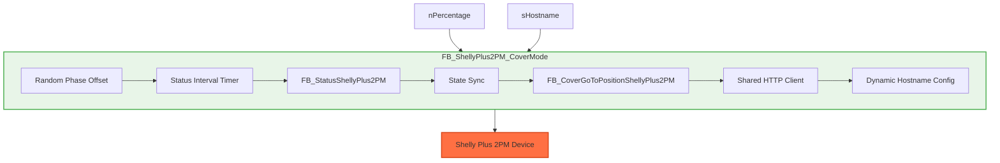
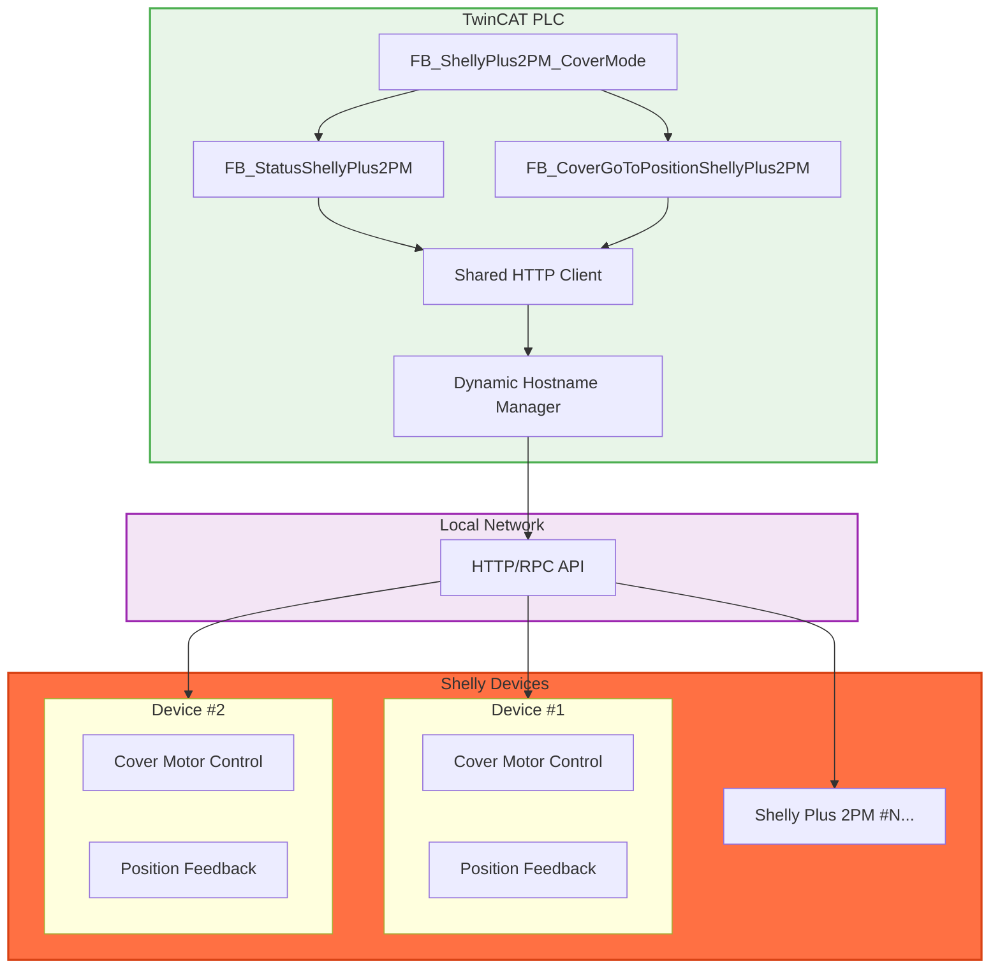

# TwinCAT Shelly Integration

> **Note:** This is a personal project, completely separate from my work at Beckhoff. It is not an official Beckhoff product and receives no official support. I created this for my own home automation needs and decided to share it in case others find it useful.

## Table of Contents

- [FB_ShellyPlus2PM_CoverMode](#fb_shellyplus2pm_covermode---comprehensive-shelly-plus-2pm-cover-control)

## FB_ShellyPlus2PM_CoverMode - Comprehensive Shelly Plus 2PM Cover Control

The `FB_ShellyPlus2PM_CoverMode` function block provides a complete solution for controlling Shelly Plus 2PM devices configured in cover/blind mode from TwinCAT. It handles bidirectional communication, automatic state synchronization, and intelligent request timing to prevent device overload.

- Complete cover/blind control with percentage-based positioning (0-100%)
- Automatic state synchronization with periodic status requests
- Intelligent random phase offset timing to distribute API calls across multiple devices
- Shared HTTP client for memory efficiency
- Built-in error handling and state recovery
- Dynamic hostname configuration for flexible device management
- HMI integration support with TcHmiSymbol attributes

### Function Block Declaration

```pascal
FUNCTION_BLOCK FB_ShellyPlus2PM_CoverMode
VAR_INPUT
    { attribute 'TcHmiSymbol.AddSymbol' }
    nPercentage     : UINT(0..100);      // Desired cover position percentage (0=closed, 100=open)
    sHostname       : STRING;            // Shelly device hostname or IP address
END_VAR
```

### Features

- **Smart Timing**: 10-second startup delay + random phase offsets prevent network congestion
- **State Synchronization**: Periodic 5-minute status requests keep PLC in sync with external changes
- **Memory Efficient**: Single shared HTTP client for all Shelly device instances
- **Rate Limiting**: Intelligent request spacing prevents Shelly device API overload
- **Error Recovery**: Automatic rollback to last known good state on failed requests
- **Dynamic Reconfiguration**: Supports changing device hostnames at runtime
- **Movement Intelligence**: Pauses status updates during cover movement operations

### Protocol Details

The function block uses Shelly's RPC API over HTTP:

- **Position Control**: `GET /rpc/Cover.GoToPosition?id=0&pos={percentage}`
- **Status Reading**: `GET /rpc/Shelly.GetStatus`
- **JSON Parsing**: Manual parsing of `current_pos` field for reliability
- **Connection Management**: 20-second timeout with automatic reconnection

### Usage Example

```pascal
VAR
    shellyCover1     : FB_ShellyPlus2PM_CoverMode;
    shellyCover2     : FB_ShellyPlus2PM_CoverMode;
    coverPosition    : UINT(0..100);
END_VAR

shellyCover1(
    nPercentage := coverPosition,
    sHostname := '192.168.1.100'
);

shellyCover2(
    nPercentage := 50,           // Fixed 50% position
    sHostname := 'shelly-blind-2.local'
);
```

### Dependencies

- **FB_ShellyPlus2PM_CoverMode**: Requires `FB_CoverGoToPositionShellyPlus2PM`, `FB_StatusShellyPlus2PM`
- **System Libraries**: `Tc3_IotBase` for HTTP client functionality
- **Utility Functions**: [`MID2`](https://github.com/vossjannik/twincat-utilities/blob/main/MID2.TcPOU), `FIND2`, `LEN2` for JSON parsing
- **Standard Libraries**: `DRAND` for random number generation

### Block Diagram



### System Architecture



### Configuration Requirements

#### Shelly Device Setup

1. Configure your Shelly Plus 2PM in **Cover Mode** via the Shelly app
2. Set up motor calibration for proper position feedback
3. Ensure device is connected to your local network
4. Note the device's IP address or hostname

#### TwinCAT Project Setup

```pascal
// Global Variables (optional)
VAR_GLOBAL
    // Example: Multiple covers in a room
    bedroom_blinds   : FB_ShellyPlus2PM_CoverMode;
    office_blinds    : FB_ShellyPlus2PM_CoverMode;

    // Control variables
    all_covers_pos   : UINT(0..100);
    manual_control   : BOOL;
END_VAR
```

### Operational Behavior

#### Startup Sequence

1. **Initialization**: Random phase offset (0-63 seconds) calculated on first run
2. **Delay Period**: 10-second network stabilization delay
3. **First Status**: Initial device status request to sync position
4. **Normal Operation**: Continuous monitoring and control

#### Request Management

- **Position Commands**: Sent immediately when `nPercentage` changes
- **Status Updates**: Every 5 minutes, plus after successful position changes
- **Movement Pause**: Status requests paused during active positioning
- **Error Recovery**: Automatic retry with state rollback on failures

#### Network Efficiency

- **Client Sharing**: Single HTTP client serves multiple device instances
- **Phase Distribution**: Random timing prevents simultaneous requests
- **Connection Reuse**: Persistent connections where possible
- **Timeout Management**: 20-second timeouts with automatic reconnection
